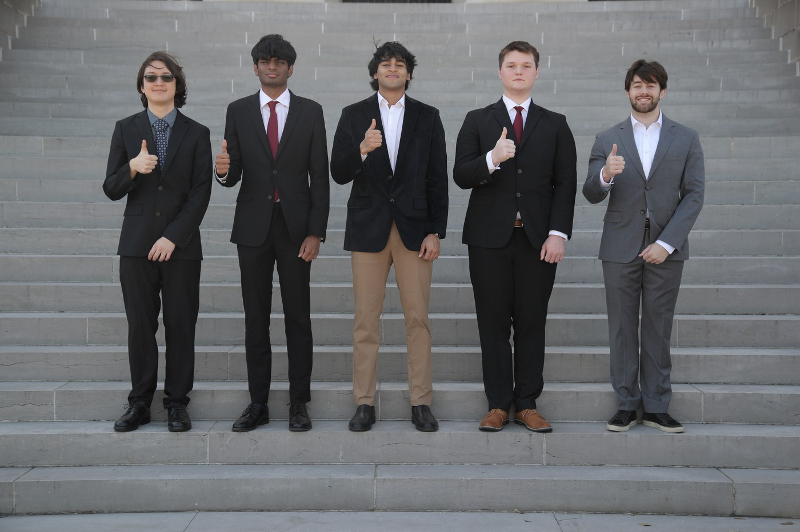

# AggiesBCI

The AggiesBCI Team: Pranav, Garner, Oswin, Yusuf (me), & Daniel. None of this would have been possible without you guys!

> 📄 **Full project write-up → [yusiali.com/projects/aggiesbci.html](https://yusiali.com/projects/aggiesbci.html)**
>
> For the complete story — the problem we set out to solve, the Aura v3 universal joystick module, the engineering decisions behind the planetary-differential redesign, and photos of the build — see the deep-dive on my site. Much of this project's work lived on the hardware and physical-design side; **this repo holds the integration code** that ties the EEG headset, serial link, and actuator together.

## Objective: Develop a brain-computer interface system that enables wheelchair control using thoughts as command inputs.
- Disassembled an e-wheelchair controller and soldered its test points to an Arduino Nano.
- Trained mental commands using an EMOTIV Insight headset and converted them into movement inputs.
- Engineered the **Aura v3** universal module: a 3D-printed planetary-differential and rack mechanism that mounts onto a wheelchair's existing joystick, so one device can fit many chairs without rewiring their electronics.
- Presented at the Aggies Create Innovation Expo and placed 1st out of 20 teams.
- Began testing the system with prospective users through a partnership with Aggies with Disabilities.

